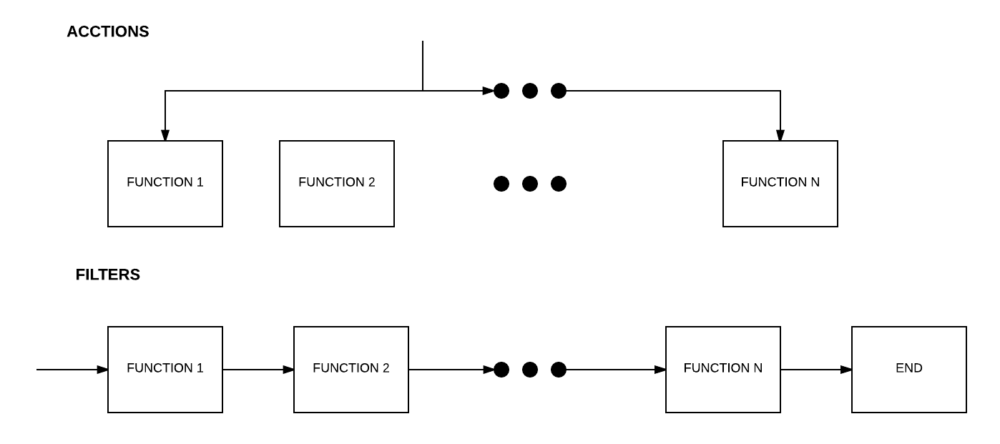

##Hooks: Acciones y filtros en Wordpress
Durante la carga de Wordpress, este realiza una serie de llamadas a una pila de funciones. Estás funciones pueden estar definidas en el mismo core, en los ficheros que forman los temas o en plugins activos. Estas serie de funciones son llamadas a través de lo denominado en Wordpress *Hooks* y pueden ser de dos tipos: 

- Acciones: Las funciones subscritas al hook se ejecutarán en "paralelo" (No es paralelo real ya que solo hay un hilo de ejecución). 
- Filtros: Las funciones subscritas al hook se ejecutarán en serie.

Funciones más usadas para acciones:

- do_action( string $tag,  $arg = '' )
- add_action( string $tag, callable $function_to_add, int $priority = 10, int $accepted_args = 1 )
- remove_action( string $tag, callable $function_to_remove, int $priority = 10 )

Funciones más usadas para los filtros:

- apply_filters( string $tag, mixed $value )
- add_filter( string $tag, callable $function_to_add, int $priority = 10, int $accepted_args = 1 )
- remove_filter( string $tag, callable $function_to_remove, int $priority = 10 )

